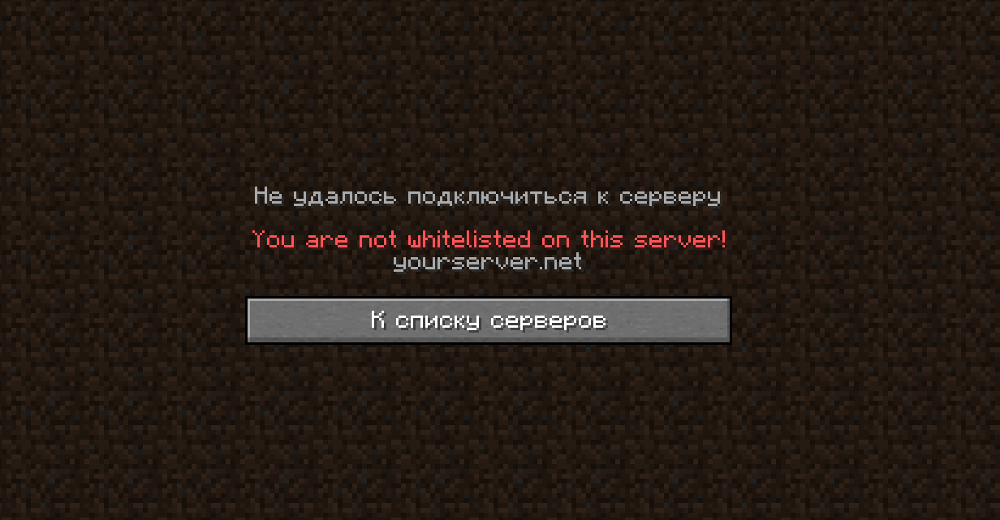

<p align="center">
  <a href="https://google.com"><b>EN</b></a>
</p>

# 🛡️ PlayerAccessList (PAL)
**PlayerAccessList** — это мощная и гибкая система управления доступом для вашего Minecraft сервера, добавляющая белый и черный список.

    



## ✨ Особенности
* **Поддержка MySQL** — Плагин способен подключаться к внешним базам данных.
* **Поддержка MiniMessage** — Плагин поддерживает новый тип форматирования из AdventureAPI.
* **Асинхронная проверка** — Плагин проверяет большинство действий асинхронно.
* **Миграция** — Плагин позволяет скопировать данные из ванильного белого списка в базу данных плагина.
* **Логирование** — Плагин позволяет логировать все в консоль или в чат модератору.
* **Система Overrides** — В плагине вы можете настроить свои сценарии с помощью Overrides.
* **Поддержка нескольких языков** — В плагине встроены несколько файлов локализации. [Предложить перевод в нашем Discord сервере](https://dsc.gg/bytepl)

## 🚀 Команды
| Команда      | Алиасы                             | Описание                                          | Пермишен |
|--------------|------------------------------------|---------------------------------------------------|-|
| `/whitelist` | `/wl, /whl`                        | Управление белым списком                          | `pal.whitelist`
| `/blacklist` | `/bl, /bll`                        | Управление черным списком                         | `pal.blacklist`
| `/pal`       | `/playeraccess, /playeraccesslist` | Основная команда плагина (перезагрузка, миграция) | `pal.admin`

## 📈 Аналитика bStats
[Посмотреть страницу **PlayerAccessList на bStats**](https://bstats.org/plugin/bukkit/PlayerAccessList/29094)


## ⚙️ API для разработчиков
Небольшое руководство по использованию API для разработчиков.

### Подключение

Чтобы подключить плагин и его API к вашему проекту, скачайте плагин.
В своём проекте создайте папку `libs`, поместите туда скачанный плагин и переименуйте его в `PlayerAccessList.jar`.

Затем мы подключаем плагин к вашему проекту как зависимость.
Замените `ВАША ВЕРСИЯ` на версию скачанного плагина.

**Maven:**
```xml
<dependencies>
    <dependency>
        <groupId>me.superchirok1</groupId>
        <artifactId>PlayerAccessList</artifactId>
        <version>ВАША ВЕРСИЯ</version>
        <scope>system</scope>
        <systemPath>${project.basedir}/libs/PlayerAccessList.jar</systemPath>
    </dependency>
</dependencies>
```
**Gradle:**
```
dependencies {
    implementation files('libs/PlayerAccessList.jar')
}
```

### Классы
Добавление игрока в белый список:
```java
// Получение класса
Whitelist whitelist = Whitelist.getInstance();

// Добавляем ник игрока
// Поддерживается также UUID, OfflinePlayer, и IP адрес.
whitelist.add("SuperCHIROK1");
```

Почти также и работает черный список
```java
Blacklist blacklist = Blacklist.getInstance();

blacklist.add("SuperCHIROK1");
```
### Классы (ивенты)

Существуют несколько таких классов-ивентов, которые можно использовать в классах-слушателях.
* `WhitelistCancelJoinEvent` - Кик игрока из-за того что его нет в белом списке.
* `BlacklistCancelJoinEvent` - Кик игрока из-за того он находиться в черном списке.

Пример: (отправка всем игрокам сообщение, то что игрок пытался войти)
```java
public class JoinListener implements Listener {
 
    @EventHandler
    public void onWhitelistCancel(WhitelistCancelJoinEvent event) {

        PlayerProfile player = event.getPlayer();
     
        String message = ChatColor.translateAlternateColorCodes('&',
                "&cИгрок &7" + player.getName() + "&c пытался войти, но не был в белом списке");
     
        Bukkit.broadcastMessage(message);
     
    }
    
}
```
